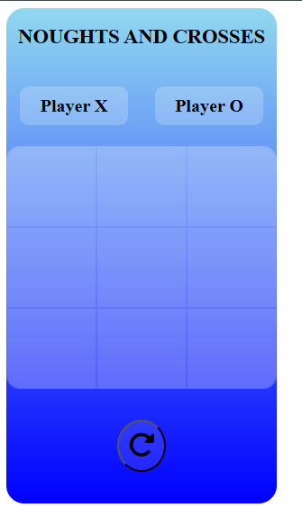
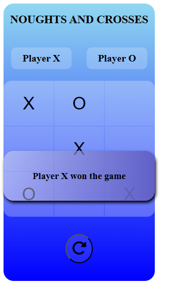

# NOUGHTS AND CROSSES (Tic-Tac-Toe)

 <h2>Description</h2>
This is a simple implementation of the classic Tic Tac Toe game using HTML, CSS, and JavaScript. The game allows two players to take turns and place their marks (X or O) on a 3x3 grid. The first player to align three marks horizontally, vertically, or diagonally wins the game. If all nine squares are filled without any player aligning three marks, the game ends in a draw.

# Features

Interactive User Interface: A responsive and user-friendly interface designed with HTML and CSS. 
Two-Player Mode: Allows two players to play the game on the same device. 
Win Detection: Automatically detects when a player has won and displays the result. 
Draw Detection: Detects when the game ends in a draw and notifies the players. 
Restart Functionality: Players can reset the game to start a new round. 

# Technologies Used

HTML: For the structure of the game. 
CSS: For styling the game. 
JavaScript: For game logic and interactivity.

# Installation

To play the game locally, follow these steps: 

Clone the repository: 
bash 
Copy code 
git clone https://github.com/tapeshchavle/Tic-Tac-Toe.git 

# Navigate to the project directory:

bash 
Copy code 
cd tictactoe  
Open the index.html file in your web browser:

# User Interface

</img>
 

 

 </img>
# How to Play
Open the index.html file in your web browser. 
The game board will be displayed, consisting of a 3x3 grid. 
Players take turns clicking on the empty squares to place their mark (Player 1 is X and Player 2 is O). 
The game will automatically check for a winner after each turn. 
If a player wins, a message will be displayed indicating the winner. 
To restart the game, click the "Restart" button. 

# Project Structure

<pre>
tictactoe/
├── index.html       # HTML file that contains the structure of the game
├── styles.css       # CSS file that contains styles for the game
└── script.js        # JavaScript file that contains the game logic
</pre>

# File Descriptions

index.html: Contains the main structure of the game, including the game board and the restart button. 
style.css: Defines the visual appearance of the game, including layout, colors, and fonts. 
app.js: Implements the game logic, including player turns, win and draw detection, and restart functionality. 

# Contributing

If you would like to contribute to this project, please fork the repository and create a pull request with your changes. Contributions are welcome!

# Contact

If you have any questions or suggestions, please feel free to contact me at tapeshchawle@gmail.com.
